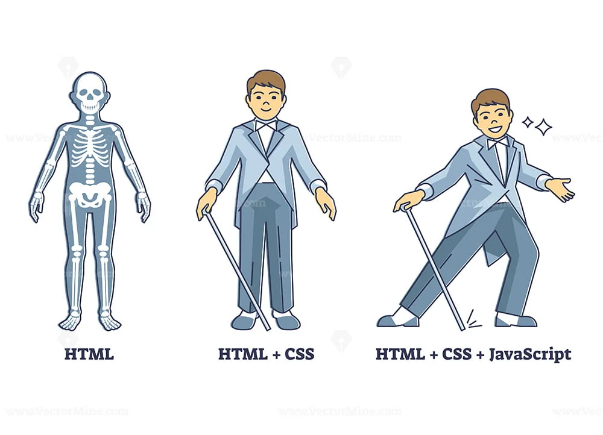
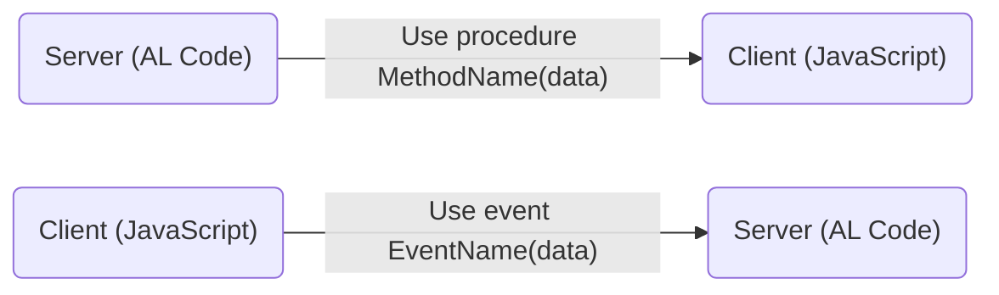

<iframe width="425" height="350" frameborder="0" scrolling="no" marginheight="0" marginwidth="0" src="https://shopify.github.io/draggable/examples/floated.html"></iframe>

# Customize Business Central UI with Control AddIns

This guide explains how to use Control AddIns in Business Central to customize the user interface by integrating JavaScript. Control AddIns allow you to create rich, interactive components that enhance the user experience within the Business Central environment.

For detailed documentation, see the [Microsoft Learn Docs](https://learn.microsoft.com/en-us/dynamics365/business-central/dev-itpro/developer/devenv-control-addin-style) and explore [Best Practices](https://learn.microsoft.com/en-us/dynamics365/business-central/dev-itpro/developer/devenv-control-addin-bestpractices).

## Prerequisite Knowledge

Before working with Control AddIns, you should be familiar with the following:

- **Web Technologies:** Basic knowledge of HTML, CSS, and JavaScript is essential. If you’re new to these technologies, explore the [Mozilla Developer Web](https://developer.mozilla.org/en-US/docs/Learn) tutorials.

<div align="center">
  
</div>

- **AL Language:** Familiarity with AL programming is crucial, especially if you’re new to the Control AddIn object. Learn the [Basics of Control AddIn](https://learn.microsoft.com/en-us/dynamics365/business-central/dev-itpro/developer/devenv-control-addin-object) to get started.

## What is a Control AddIn?

### Overview
A Control AddIn is a custom control or visual element in Business Central, allowing developers to extend the functionality of pages and provide a more interactive experience. They can be used to display web content, visualize data in charts, maps, or other custom formats, and interact with Business Central data.

### Key Features
1. **Custom UI Elements:** Control AddIns enable the creation of custom UI elements that can be embedded directly into Business Central pages.
2. **Interactive Data Visualization:** You can use Control AddIns to create dynamic charts, graphs, and maps that provide users with real-time data visualization.
3. **Event Handling:** Control AddIns can respond to user interactions such as clicks or inputs, triggering AL code that can update data or perform actions within Business Central.
4. **Data Exchange:** Control AddIns can exchange data with the Dynamics 365 server using various data types, making it possible to integrate external data sources or APIs.

### Example Use Cases
- **Custom Dashboards:** Use Control AddIns to create interactive dashboards that display key performance indicators (KPIs) and allow users to filter and manipulate data in real time.
- **Enhanced Data Entry:** Create custom forms or input controls that provide a more intuitive data entry experience, including features like auto-complete, validation, and complex input types.
- **Embedded Applications:** Integrate third-party applications or custom web apps directly into Business Central pages, providing a seamless user experience.


## Setup

### File Structure Custom Control AddIn
The structure of a typical Business Central project with a custom Control AddIn might look like this:

```md
Custom BC Project
├── .alpackages
├── .snapshots
├── .vscode
├── src
│   ├── table
│   ├── page 
│   ├── ...
│   └── controladdin
│       └── HelloWorld
│           ├── js
│           │   └── index.js
│           ├── css
│           │   └── index.css
│           └── ControlAddIn.HelloWorld.al
├── app.json
└── Default-Publisher_Custom-BC-Project.app
```

### File Breakdown
- **index.js:** Contains the JavaScript code that defines the behavior and interaction logic of the Control AddIn.
- **index.css:** Provides custom styling to ensure the Control AddIn integrates smoothly with the Business Central UI.
- **ControlAddIn.HelloWorld.al:** This AL file defines the Control AddIn object in Business Central, specifying the properties, events, and integration points.

## How to Create?

### Step-by-Step Guide
1. **Creating a Control AddIn:**
   - Typically, the AL AZ Wizard is used to create objects in Business Central projects. However, creating a Control AddIn requires manual setup.
   - Start by creating a new AL file in your project. You can use snippets to help with the initial setup by typing the command `tcontroladdin`, which provides a template for creating a Control AddIn.
```AL
controladdin "Control Add-in Name"
{
    // The height and width that you want to get from the Iframe component. (value type: pixels)
    RequestedHeight = 300;
    RequestedWidth = 700;

    // The minimum height and width that your control add-in needs. 
    // If the available space would be less, then you'll get scrollbars. (value type: pixels).
    MinimumHeight = 300;
    MinimumWidth = 700;

    // The maximum height and width of your control add-in. (value type: pixels).
    MaximumHeight = 300;
    MaximumWidth = 700;

    // Boolean value indicating if the control can stretch and/or shrink horizontally or vertically (value type: boolean).
    VerticalStretch = true;
    VerticalShrink = true;
    HorizontalStretch = true;
    HorizontalShrink = true;

    // The StartupScript property is used to define which JavaScript file should be run on startup. 
    // You can specify other JavaScript files that you need in the Scripts property. (value type: string_path)
    StartupScript = 'src/controladdin/HelloWorld/startup.js';

    // The scripts should be located within your AL extension. 
    // You can also load external scripts over HTTP(S). 
    // Alternatively, you can use jQuery or another JavaScript library. (value type: string_path)
    // Example: 'https://code.jquery.com/jquery-3.2.1.min.js','script1.js'; 
    Scripts = 'src/controladdin/HelloWorld/main.js';

    // You can specify other JavaScript files that should be loaded and 
    // run when the page is recreated or refreshed, respectively.
    // RecreateScript = 'recreateScript.js';
    // RefreshScript = 'refreshScript.js';

    // The stylesheet should be located within your AL extension. (value type: string_path)
    StyleSheets = 'src/controladdin/HelloWorld/main.css';

    // If you want to use images in your control add-in object, 
    // you need to add them to your extension and add the filename to the Images property. (value type: string_path)
    // Images = 'image1.png', 'image2.png';

    // Throw events from Client to Server.
    event CallFromJS();

    // Throw events from Server to Client.
    procedure CallFromAL();
}
```
> [!WARNING]
> Specify at least one JavaScript file using the Scripts property to provide the client-side functionality.

2. **Adding JavaScript:**
Create a JavaScript file (`.js`) and place it in the same directory as your Control AddIn AL file. This script will define the logic and behavior of your custom control.

3. **Styling Your Control AddIn:**
Use a CSS file (`.css`) to style your Control AddIn, ensuring it matches the look and feel of the Business Central environment.

4. **Registering and Using the Control AddIn:**
Embed the Control Add-in similar to how you would embed a Card or List part page. Using ``usercontrol`` field to a page (like a FactBox or a Role Center page) to display the custom UI component directly alongside other page elements.

```AL
 layout
    {
        area(Content)
        {
            group(General)
            {
                usercontrol(HelloWorld; HelloWorld)
                {
                    ApplicationArea = Basic;
                }
            }
        }

        area(FactBoxs)
        {
            usercontrol(HelloWorld; HelloWorld)
            {
                ApplicationArea = Basic;
            }
        }
    }
```


6. **Exchanging Result:**
   - To transfer a result from an AL method to the client, just add a method to the control add-in interface (in javascript) that the AL trigger can invoke to send the result to the script.
   - To transfer a result from a script method to an AL trigger, just add an event to the control add-in interface that the script method can use to invoke an AL trigger that receives the result.


### Best Practices

- **Modular Design:** Break your add-in into smaller, reusable modules for easier development and maintenance.
- **Performance Optimization:** When developing control add-ins it's important to provide the best possible experience, as well as performance so that users can maintain their productivity without interruption.
- **Responsive Design:** Use responsive design techniques in your CSS to ensure the Control AddIn looks good on different devices and screen sizes.
- **Error Handling:** Implement robust error handling in your JavaScript code to manage unexpected behaviors and enhance user experience.

> [!TIP]
> To ensure a consistent and visually appealing user experience, follow Microsoft's styling guidelines. You can find the official styling guide and resources provided by Microsoft [here](https://learn.microsoft.com/en-us/dynamics365/business-central/dev-itpro/developer/devenv-control-addin-style)

## Conclusion

Control AddIns offer a powerful way to extend and customize the Business Central UI, providing users with enhanced interactive experiences. By following the setup guide and best practices, you can create custom controls that integrate seamlessly with Business Central, offering new capabilities and improving overall productivity.


